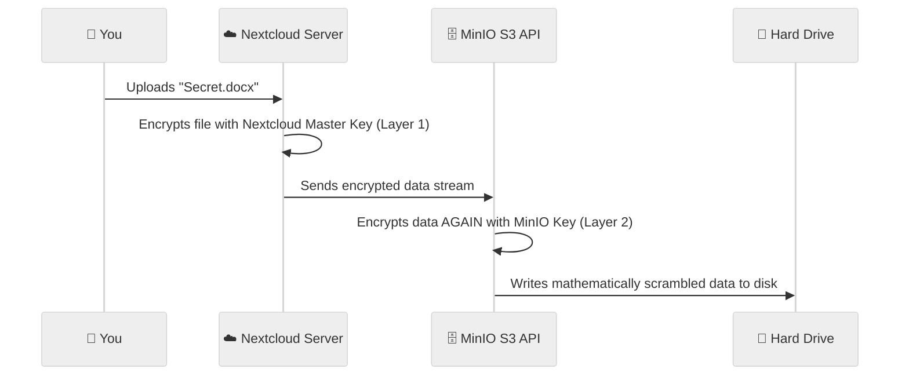

# How to Configure MinIO Encryption

This document outlines how we secure and encrypt files stored in Nextcloud using MinIO's enterprise-grade encryption features. For a fully sovereign cloud, we use a **Defense-in-Depth** strategy.

## The Defense-in-Depth Model

We protect our documents using two separate layers of encryption:

1. **Nextcloud Server-Side Encryption (Layer 1):** Nextcloud encrypts the file before it even leaves the Nextcloud server. Nextcloud holds the master encryption keys.
2. **MinIO Server-Side Encryption (Layer 2):** When MinIO receives the file from Nextcloud, MinIO encrypts it *again* before writing it to the physical hard drive.

## Encryption Flow


## MinIO Encryption Types

MinIO supports several types of Server-Side Encryption (SSE). 

### 1. SSE-S3 (Default MinIO Managed)
- **How it works:** MinIO automatically generates unique encryption keys for every single file uploaded. MinIO completely manages the keys.
- **Easy English:** "Just encrypt it for me, I don't want to worry about keys."
- **Use Case:** Best for standard deployments where the hard drive itself might be stolen, but you trust the MinIO server completely.

### 2. SSE-KMS (Key Management Service)
- **How it works:** MinIO connects to an external, highly secure vault (like HashiCorp Vault) to request encryption keys. The master keys are never stored inside MinIO.
- **Easy English:** "Encrypt it, but keep the master key locked in a separate physical bank vault."
- **Use Case:** Required for Enterprise compliance. If the MinIO server is compromised, the attacker still cannot decrypt the files without hacking the separate Vault server.

### 3. SSE-C (Client-Provided Keys)
- **How it works:** Nextcloud (the client) provides the specific encryption key to MinIO every time it uploads or downloads a file. MinIO uses the key, and immediately throws it away. MinIO never stores the key on disk.
- **Easy English:** "I'll bring my own key every time I want to open the door. Don't make a copy."
- **Use Case:** Ultimate sovereignty. MinIO is completely blind to the data. Even if a rogue admin copies the entire MinIO server, they have absolutely zero access to the data without Nextcloud's keys.

## Recommendation

For a sovereign office suite deployment, we recommend using **SSE-KMS** backed by HashiCorp Vault, combined with Nextcloud's internal Server-Side Encryption. This guarantees that even in the event of a total infrastructure breach, your office documents remain mathematically secure.

---

## How to Setup KMS Encryption

To enable SSE-KMS with HashiCorp Vault, you need to add specific environment variables to your MinIO deployment (`minio_enterprise_deployment.yaml`).

### Step 1: Configure the KMS Environment Variables
Add these lines to the `env` section of your MinIO container:

```yaml
        env:
        # NOTE: This tells MinIO to connect to your HashiCorp Vault server for the Master Keys
        - name: MINIO_KMS_KES_ENDPOINT
          value: "https://your-vault-server:7373"
          
        # NOTE: This is the cryptographic key MinIO uses to authenticate itself to the Vault
        - name: MINIO_KMS_KES_KEY_FILE
          value: "/etc/minio/certs/kes-client.key"
          
        # NOTE: This is the certificate MinIO uses to authenticate itself
        - name: MINIO_KMS_KES_CERT_FILE
          value: "/etc/minio/certs/kes-client.crt"
          
        # NOTE: This defines the specific master key name in the Vault that Nextcloud should use
        - name: MINIO_KMS_KES_KEY_NAME
          value: "nextcloud-master-key"
```

### Step 2: Apply and Restart
Apply the updated configuration so MinIO restarts and connects to the Vault:
`kubectl apply -f minio_enterprise_deployment.yaml`

### Step 3: Configure Nextcloud to use SSE-KMS
By default, Nextcloud doesn't specify KMS when talking to S3. You must tell Nextcloud to request SSE-KMS encryption for every file it uploads:

1. SSH into your Nextcloud pod or use your Ansible configuration to modify `config.php`.
2. Add the `use_sse_kms` parameter to your S3 storage configuration:

```php
'objectstore' => [
    'class' => '\\OC\\Files\\ObjectStore\\S3',
    'arguments' => [
        'bucket' => 'nextcloud-vault',
        'hostname' => 'minio-system.svc.cluster.local',
        'port' => 9000,
        'use_ssl' => false,
        'use_path_style' => true,
        // NOTE: This forces Nextcloud to tell MinIO to encrypt the file using the KMS Key
        'use_sse_kms' => true, 
    ],
],
```
