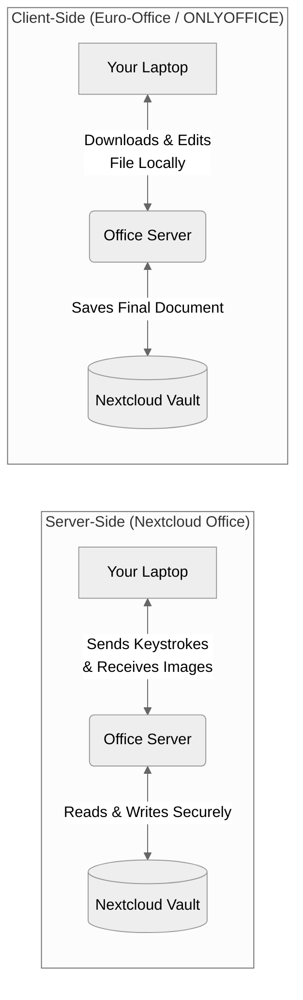

# Sovereign Office Suites Comparison

This document provides a comprehensive technical and feature-level comparison of the three major office suites available for integration: **Nextcloud Office (Collabora)**, **ONLYOFFICE**, and **Euro-Office**.

## 1. High-Level Overview

### Architecture Flow Comparison

| Feature / Capability | Nextcloud Office (Collabora) | ONLYOFFICE (Original) | Euro-Office (2026 Fork) |
| :--- | :--- | :--- | :--- |
| **Native Architecture** | OpenDocument (`.odt`, `.ods`) | Microsoft XML (`.docx`, `.xlsx`) | Microsoft XML (`.docx`, `.xlsx`) |
| **Rendering Method** | **Server-Side** (Best for older/slower devices) | **Client-Side** (Snappy, uses local CPU) | **Client-Side** (Snappy, uses local CPU) |
| **Microsoft Office Fidelity**| **Good** (Complex MS macros may break) | **Flawless** (Pixel-perfect clone) | **Flawless** (Pixel-perfect clone) |
| **Concurrent Connections** | **Unlimited** (Hardware dependent) | **Hard Capped at 20** (Unless paid) | **Unlimited** (Hardware dependent) |
| **UI Integration** | **Deepest** (Sidebar chats, Nextcloud Talk) | **Moderate** (Isolated editor window) | **Moderate** (Isolated editor window) |
| **Mobile Web Editing** | **100% Free** | **Paywalled** (Enterprise License Req.)| **100% Free** |
| **Sovereignty / Licensing** | **Transparent** (European Open Source) | **Opaque** (Artificial paywalls) | **Transparent** (Sovereign Open Source)|

---

## 2. Rendering Architecture

Understanding where the processing happens is critical for infrastructure planning.

### Nextcloud Office (Collabora)
* **Method:** Server-Side Rendering (SSR)
* **How it works:** The backend server runs the LibreOffice engine, renders the document as images (tiles), and streams them to the browser.
* **Impact:** Ultra-lightweight for the client (low RAM/CPU). Perfect for older devices or strict battery conservation, but requires a more robust backend server and stable internet.

### ONLYOFFICE & Euro-Office
* **Method:** Client-Side Rendering (CSR)
* **How it works:** Uses HTML5 Canvas directly in the user's web browser.
* **Impact:** Snappy, zero-latency desktop feel. Offloads heavy lifting from the main server to the user's local machine.

---

## 3. Concurrency & Collaboration

### Nextcloud Office (Collabora)
* **Real-time Engine:** All users view the same server-generated tiles simultaneously.
* **Key Advantage:** Deepest Nextcloud integration. You can `@mention` users to trigger push notifications, reply to comments from the Nextcloud sidebar, or start a Talk video call natively while editing.

### ONLYOFFICE
* **Real-time Engine:** Character-by-character real-time typing rendered on the client.
* **Limitation:** The community edition restricts you to a maximum of 20 concurrent connections.

### Euro-Office
* **Real-time Engine:** Inherits ONLYOFFICE's character-by-character real-time typing.
* **Key Advantage:** Removes the artificial 20-user limit completely. Includes a dedicated Admin Panel (`/admin/`) to monitor active concurrent connections and scale Kubernetes pods based on real-time load.

---

## 4. File Formats & Compatibility

### Nextcloud Office (Collabora)
* **Native Formats:** Open Document Format (`.odt`, `.ods`, `.odp`).
* **Translation:** Opens `.docx` and `.xlsx` by translating them to ODF in the background.
* **Best Use Case:** Government, legal, or academic teams committed to open standards.

### ONLYOFFICE & Euro-Office
* **Native Formats:** Microsoft Office Formats (`.docx`, `.xlsx`, `.pptx`).
* **Translation:** Reads and writes direct XML. Pixel-perfect fidelity for complex Microsoft macros and transitions.
* **Best Use Case:** Corporate teams constantly exchanging complex files with external clients using Microsoft 365.

---

## 5. App Suites & Unique Tools

### Nextcloud Office (Collabora)
* **Unique Tool:** **Collabora Draw** – A built-in vector graphics editor for diagrams and flowcharts in the browser.
* **Strengths:** Excellent at handling massive spreadsheet calculations (Pivot tables processed by server CPU). Admin capability to force invisible watermarks.

### ONLYOFFICE
* **Strengths:** Spreadsheet editor supports over 400 native formulas with a UI virtually identical to Excel Online.

### Euro-Office
* **Unique Tool:** **System Admin Panel** – Dedicated JWT key management and deep system/converter logs.
* **Strengths:** Inherits the 400+ formulas and Microsoft-like UI from ONLYOFFICE, but unlocks enterprise administration features for free.

---

## 6. Strategic Recommendation

* **Choose Nextcloud Office (Collabora) if...** Your organization prioritizes Open Formats (ODF), needs the absolute deepest native Nextcloud UI integration, and requires maximum endpoint security (watermarking, zero client-side processing).
* **Choose Euro-Office if...** Your organization requires flawless, pixel-perfect Microsoft Office document compatibility and you want the highly responsive, low-latency feel of client-side HTML5 rendering without paying for ONLYOFFICE's enterprise licenses.
