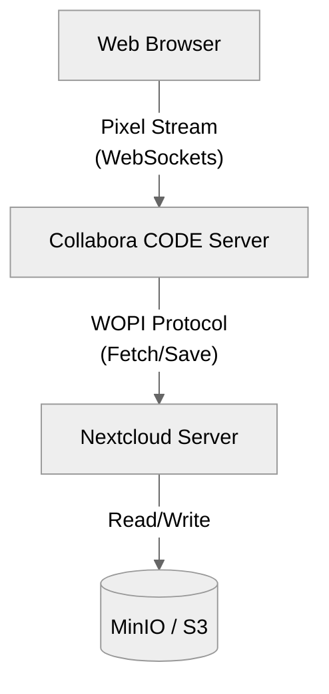
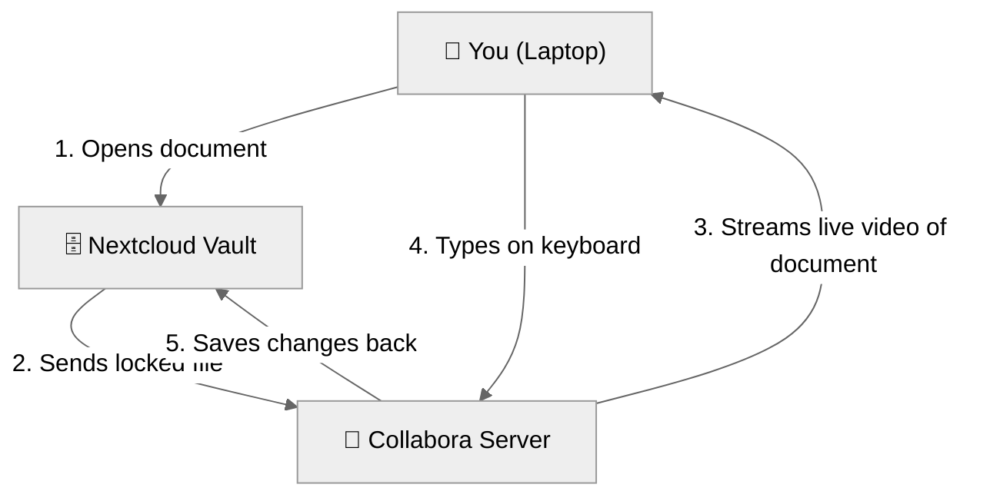

# Collabora Online (Nextcloud Office)

## Description and Benefits
Collabora Online (often officially branded as "Nextcloud Office") is the original, default office suite for Nextcloud. It is based on LibreOffice and renders documents entirely on the server-side, streaming the visual result to the user's browser.
**Benefits:**
- Exceptional compatibility with OpenDocument Formats (ODT, ODS).
- High security because no document data ever touches the client's local cache (pixels are streamed).
- Official long-term support from Nextcloud.

## Security Model
Collabora operates on a **Zero-Data-on-Client** security model. Because the document is rendered entirely on the server, the user's web browser only receives a stream of pixels (images) representing the document. 
- No raw document data is ever cached in the local browser.
- Prevents data leakage on public or compromised client machines.
- All server-to-server communication is encrypted and verified via WOPI proof keys.

## Technical Architecture


## Document Editing Process


## Setup Instructions

> [!IMPORTANT]
> **The Golden Rule of Setup**
> You must **always** apply the Kubernetes deployment first, and wait for the backend engine to be `READY`, before configuring Nextcloud. If the server isn't running, Nextcloud will reject the connection!
> 
> *Note on Naming:* Be careful with names. The Nextcloud connector app is called `richdocuments` (often labeled as "Nextcloud Office" in the GUI), while the backend engine is Collabora CODE.

### Command Line Setup
1. Apply the Kubernetes manifests:
   `kubectl apply -f deployment.yaml`
2. Install the connector app in Nextcloud:
   `php occ app:install richdocuments`
3. Configure Nextcloud to use your server URL:
   `php occ config:app:set richdocuments wopi_url --value="https://collabora.yourdomain.com"`

### GUI Setup
1. Log into Nextcloud as Admin.
2. Go to **Apps** -> **Office & text** and install **Nextcloud Office**.
3. Go to **Administration Settings** -> **Office**.
4. Select **Use your own server** and enter `https://collabora.yourdomain.com`.

---

## Configuration Code (Kubernetes Manifests)

Below are the complete YAML configurations needed to deploy Collabora on your cluster.

### deployment.yaml
```yaml
apiVersion: apps/v1
kind: Deployment
metadata:
  name: collabora
  namespace: nextcloud-system
spec:
  replicas: 1
  selector:
    matchLabels:
      app: collabora
  template:
    metadata:
      labels:
        app: collabora
    spec:
      containers:
      - name: collabora
        image: collabora/code:latest
        securityContext:
          runAsNonRoot: true
          allowPrivilegeEscalation: false
          capabilities:
            drop:
            - ALL
        env:
        # NOTE: aliasgroup1 tells Collabora which Nextcloud domains are allowed to connect to it securely.
        # Always include both the standard URL and the :443 port version.
        - name: aliasgroup1
          value: "https://nextcloud.sengporkeat.com:443,https://nextcloud.sengporkeat.com"
          
        # NOTE: extra_params disables internal SSL because your Kubernetes Ingress (Traefik) is already handling HTTPS.
        - name: extra_params
          value: "--o:ssl.enable=false --o:ssl.termination=true --o:mount_jail_tree=false --o:security.seccomp=false --o:security.capabilities=false"
        ports:
        - containerPort: 9980
```

### service.yaml
```yaml
apiVersion: v1
kind: Service
metadata:
  name: collabora
  namespace: nextcloud-system
spec:
  selector:
    app: collabora
  ports:
  - port: 9980
    targetPort: 9980
```

### ingress.yaml
```yaml
apiVersion: networking.k8s.io/v1
kind: Ingress
metadata:
  name: collabora-ingress
  namespace: nextcloud-system
  annotations:
    # NOTE: This automatically generates a free Let's Encrypt SSL certificate for your domain.
    cert-manager.io/cluster-issuer: "letsencrypt-prod"
    # NOTE: This forces all traffic to be secure (HTTPS).
    traefik.ingress.kubernetes.io/router.entrypoints: websecure
spec:
  tls:
  - hosts:
    - office.sengporkeat.com
    secretName: office-tls-secret
  rules:
  - host: office.sengporkeat.com
    http:
      paths:
      - path: /
        pathType: Prefix
        backend:
          service:
            name: collabora
            port:
              number: 9980
```
