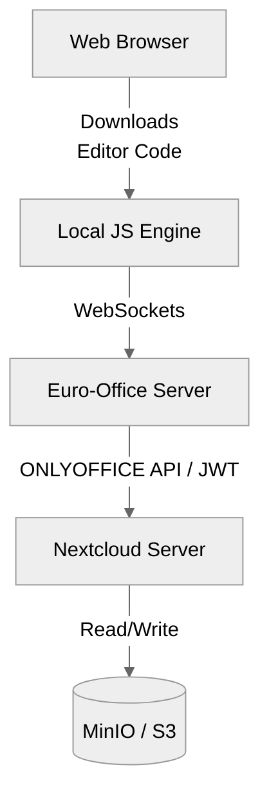
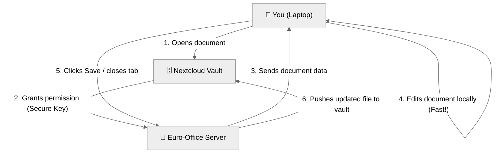

# Euro-Office Document Server

## Description and Benefits
Euro-Office is a modern, European-maintained fork of ONLYOFFICE. It was created to provide a fully open-source alternative without some of the commercial restrictions or tracking of the upstream project, and is heavily endorsed by Nextcloud as their new preferred engine.
**Benefits:**
- Retains the exact same perfect Microsoft Office compatibility and speed as ONLYOFFICE.
- Tighter, officially supported integration with Nextcloud's ecosystem.
- Fully GDPR compliant and European-hosted data philosophies.

## Security Model
Euro-Office inherits the secure **JWT architecture** of its upstream parent (ONLYOFFICE), but adds a strict **GDPR-compliant** philosophy.
- No forced telemetry or hidden tracking analytics reporting back to the developers.
- Cryptographically signed JWT tokens authorize all server-to-server file transfers.
- Full open-source transparency ensures security researchers can independently audit the backend engine.

## Technical Architecture


## Document Editing Process


## Setup Instructions

> [!IMPORTANT]
> **The Golden Rule of Setup**
> You must **always** apply the Kubernetes deployment first, and wait for the backend engine to be `READY`, before configuring Nextcloud. If the server isn't running, Nextcloud will reject the connection!
> 
> *Note on Naming:* Be careful with names. Because Euro-Office is a fork, it does **not** have its own app. You must use the `onlyoffice` connector app in Nextcloud to connect to the Euro-Office backend engine!

### Command Line Setup
1. Apply the Kubernetes manifests:
   `kubectl apply -f deployment.yaml`
2. Install the ONLYOFFICE connector app (Euro-Office uses the ONLYOFFICE API layer):
   `php occ app:install onlyoffice`
3. Configure the connector:
   `php occ config:app:set onlyoffice DocumentServerUrl --value="https://eurooffice.yourdomain.com"`
   `php occ config:app:set onlyoffice jwt_secret --value="your_secure_secret"`

### GUI Setup
1. Log into Nextcloud as Admin.
2. Go to **Apps** and install the **ONLYOFFICE** connector (used as the bridge for Euro-Office).
3. Go to **Administration Settings** -> **ONLYOFFICE**.
4. Enter your Euro-Office Server address (`https://eurooffice.yourdomain.com`).
5. Enter your Secret key (JWT). Save.

---

## Configuration Code (Kubernetes Manifests)

Below are the complete YAML configurations needed to deploy Euro-Office on your cluster.

### deployment.yaml
```yaml
apiVersion: apps/v1
kind: Deployment
metadata:
  name: euro-office
  namespace: nextcloud-system
spec:
  replicas: 1
  selector:
    matchLabels:
      app: euro-office
  template:
    metadata:
      labels:
        app: euro-office
    spec:
      containers:
      - name: euro-office
        image: ghcr.io/euro-office/documentserver:latest
        env:
        # NOTE: JWT_SECRET acts as a password between Nextcloud and Euro-Office so nobody else can access your documents.
        # This MUST exactly match the Secret Key you type into the Nextcloud Admin Settings!
        - name: JWT_SECRET
          value: "eurooffice_secret_key_2412"
          
        # NOTE: This ensures that the secret key is required for all connections.
        - name: JWT_ENABLED
          value: "true"
          
        # NOTE: This specifies how the secret key is sent over the network (AuthorizationJwt is the standard).
        - name: JWT_HEADER
          value: "AuthorizationJwt"
        ports:
        - containerPort: 80
```

### service.yaml
```yaml
apiVersion: v1
kind: Service
metadata:
  name: euro-office
  namespace: nextcloud-system
spec:
  selector:
    app: euro-office
  ports:
  - port: 80
    targetPort: 80
```

### ingress.yaml
```yaml
apiVersion: networking.k8s.io/v1
kind: Ingress
metadata:
  name: euro-office-ingress
  namespace: nextcloud-system
  annotations:
    # NOTE: This automatically generates a free Let's Encrypt SSL certificate for your domain.
    cert-manager.io/cluster-issuer: "letsencrypt-prod"
    # NOTE: This forces all traffic to be secure (HTTPS).
    traefik.ingress.kubernetes.io/router.entrypoints: websecure
spec:
  tls:
  - hosts:
    - office.sengporkeat.com
    secretName: office-tls-secret
  rules:
  - host: office.sengporkeat.com
    http:
      paths:
      - path: /
        pathType: Prefix
        backend:
          service:
            name: euro-office
            port:
              number: 80
```
