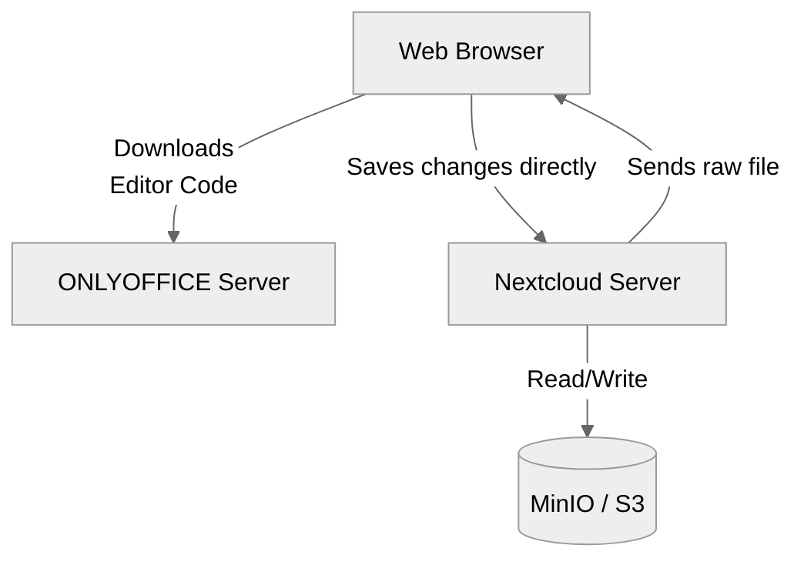
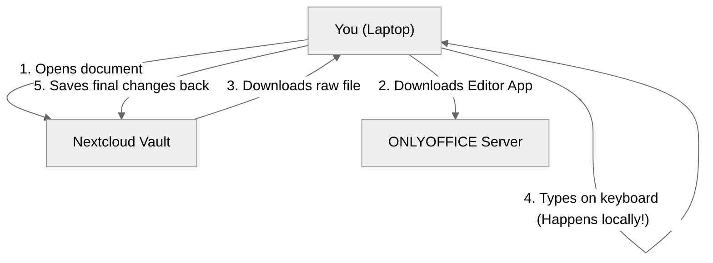

# ONLYOFFICE Document Server

## Description and Benefits
ONLYOFFICE is a highly popular, modern document editor that renders documents entirely client-side (in the user's browser using HTML5 Canvas). 
**Benefits:**
- The absolute best compatibility with Microsoft Office formats (`.docx`, `.xlsx`, `.pptx`).
- Very fast editing experience because it offloads rendering to the user's computer, saving server CPU resources.
- Clean, familiar tabbed UI similar to Microsoft Office.

## Security Model
ONLYOFFICE secures its connections using a mandatory **JWT (JSON Web Token)** handshake. 
- The Nextcloud server cryptographically signs a payload authorizing the user to open a specific file.
- The ONLYOFFICE Document Server verifies this signature before serving the editing client to the browser.
- Once the editing session concludes, the Document Server securely pushes the final compiled file back to Nextcloud via an authenticated callback.

## Technical Architecture


## Document Editing Process


## Setup Instructions

> [!IMPORTANT]
> **The Golden Rule of Setup**
> You must **always** apply the Kubernetes deployment first, and wait for the backend engine to be `READY`, before configuring Nextcloud. If the server isn't running, Nextcloud will reject the connection!
> 
> *Note on Naming:* Be careful with names. The Nextcloud connector app is explicitly called `onlyoffice` in both the command line and the GUI. It connects to the ONLYOFFICE Document Server backend.

### Command Line Setup
1. Apply the Kubernetes manifests:
   `kubectl apply -f deployment.yaml`
2. Install the ONLYOFFICE connector app in Nextcloud:
   `php occ app:install onlyoffice`
3. Configure Nextcloud to use your server URL and JWT:
   `php occ config:app:set onlyoffice DocumentServerUrl --value="https://onlyoffice.yourdomain.com"`
   `php occ config:app:set onlyoffice jwt_secret --value="your_secure_secret"`

### GUI Setup
1. Log into Nextcloud as Admin.
2. Go to **Apps** and install the **ONLYOFFICE** connector app.
3. Go to **Administration Settings** -> **ONLYOFFICE**.
4. In the Server settings, enter the Document Editing Service address (`https://onlyoffice.yourdomain.com`).
5. Expand Advanced settings and enter your Secret key (JWT). Save.

---

## Configuration Code (Kubernetes Manifests)

Below are the complete YAML configurations needed to deploy ONLYOFFICE on your cluster.

### deployment.yaml
```yaml
apiVersion: apps/v1
kind: Deployment
metadata:
  name: onlyoffice
  namespace: nextcloud-system
spec:
  replicas: 1
  selector:
    matchLabels:
      app: onlyoffice
  template:
    metadata:
      labels:
        app: onlyoffice
    spec:
      containers:
      - name: onlyoffice
        image: onlyoffice/documentserver:latest
        env:
        # NOTE: JWT_SECRET acts as a password between Nextcloud and ONLYOFFICE so nobody else can access your documents.
        # This MUST exactly match the Secret Key you type into the Nextcloud Admin Settings!
        - name: JWT_SECRET
          value: "onlyoffice_secret_key_2412"
          
        # NOTE: This ensures that the secret key is required for all connections.
        - name: JWT_ENABLED
          value: "true"
          
        # NOTE: This specifies how the secret key is sent over the network (AuthorizationJwt is the standard).
        - name: JWT_HEADER
          value: "AuthorizationJwt"
        ports:
        - containerPort: 80
```

### service.yaml
```yaml
apiVersion: v1
kind: Service
metadata:
  name: onlyoffice
  namespace: nextcloud-system
spec:
  selector:
    app: onlyoffice
  ports:
  - port: 80
    targetPort: 80
```

### ingress.yaml
```yaml
apiVersion: networking.k8s.io/v1
kind: Ingress
metadata:
  name: onlyoffice-ingress
  namespace: nextcloud-system
  annotations:
    # NOTE: This automatically generates a free Let's Encrypt SSL certificate for your domain.
    cert-manager.io/cluster-issuer: "letsencrypt-prod"
    # NOTE: This forces all traffic to be secure (HTTPS).
    traefik.ingress.kubernetes.io/router.entrypoints: websecure
spec:
  tls:
  - hosts:
    - office.sengporkeat.com
    secretName: office-tls-secret
  rules:
  - host: office.sengporkeat.com
    http:
      paths:
      - path: /
        pathType: Prefix
        backend:
          service:
            name: onlyoffice
            port:
              number: 80
```
