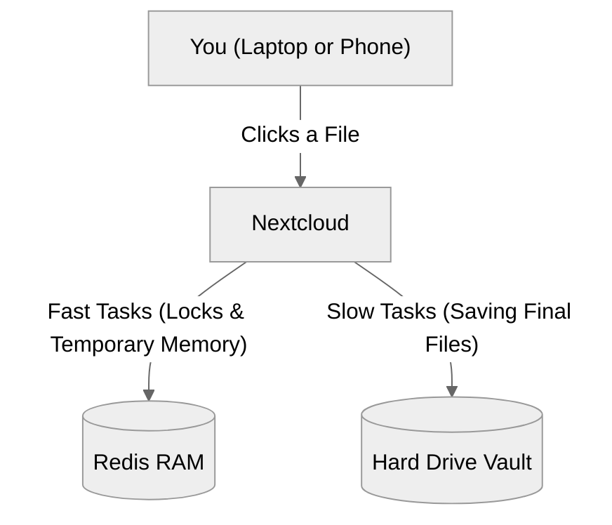

# How to Setup Redis with Nextcloud

This guide explains how to easily connect Redis to Nextcloud. Think of Redis as a super-fast **Memory Booster** for your server. 

## 1. Why Do We Need Redis?
Normally, Nextcloud saves everything to a standard hard drive database. When many people edit documents at the same time, the hard drive gets overwhelmed, causing Nextcloud to lag.

Redis fixes this by using **RAM (Lightning-Fast Memory)** instead of the hard drive for quick tasks.

### The Benefits:

> [!TIP]
> ** Fixes Office Lag**
> Makes typing in Collabora or ONLYOFFICE perfectly smooth. Redis handles the rapid, continuous background saves in RAM instead of hammering the hard drive.

> [!IMPORTANT]
> ** Stops "Stuck" Files**
> If your internet connection drops while you are editing, Redis automatically unlocks the file instantly so your colleagues can get back to work without calling IT.

> [!TIP]
> ** Speeds up Browsing**
> Loads your folders and user profiles instantly. Nextcloud pulls this data straight from Redis without ever making you wait for the slow hard drive.

> [!CAUTION]
> ** Blocks Hackers Instantly**
> Tracks bad password attempts in lightning-fast memory, allowing Nextcloud to block attackers immediately before they can crash your database.

---

## 2. How it Works (The Concept)



**When you edit a document:**
1. Nextcloud tells Redis: *"Lock this file instantly so nobody else overwrites it!"*
2. Nextcloud tells the Hard Drive: *"Save this final document."*

---

## 3. Setup Instructions (Helm)

> [!NOTE]
> **Do I need to install Redis first?**
> No! The Nextcloud Helm chart comes with Redis built-in. When you flip the switch below, Helm will automatically download, install, and configure a brand new Redis server for you. You do not need to do any prior setup!

Because Nextcloud is managed by **Helm**, turning on Redis is as simple as flipping a switch in your configuration file!

### Step 1: Turn on Redis in your Settings
Open your Nextcloud `values.yaml` file and make sure this Redis block is added:

```yaml
redis:
  # NOTE: This flips the switch to install and turn Redis ON
  enabled: true
  
  auth:
    enabled: true
    # NOTE: Set a secure password here so nobody else can read your fast memory
    password: "redis-secure-pass-2412"
    
  master:
    persistence:
      # NOTE: Keep this 'false'. Memory is meant to be temporary and fast!
      enabled: false
```

### Step 2: Deploy with Helm
Apply the changes to your Kubernetes cluster by running this professional Helm command in your terminal:
```bash
helm upgrade nextcloud nextcloud/nextcloud -f values.yaml --namespace nextcloud-system
```

### What Happens Next?
You are done! 
Your cluster will automatically spin up the Redis container, update Nextcloud's configuration to use it, and instantly start routing all your heavy traffic into the super-fast RAM!

---

## 4. Advanced: Using an External Redis Server

If you already have a massive Redis cluster deployed elsewhere and want Nextcloud to use it (instead of building its own), simply change your `values.yaml` to this:

```yaml
# Turn OFF the built-in Redis
redis:
  enabled: false

# Tell Nextcloud to use your external Redis server
externalDatabase:
  redis:
    host: "redis.your-company-network.com"
    port: 6379
    password: "your-external-password"
```
